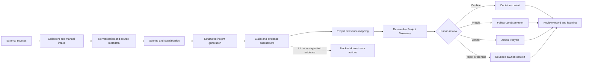
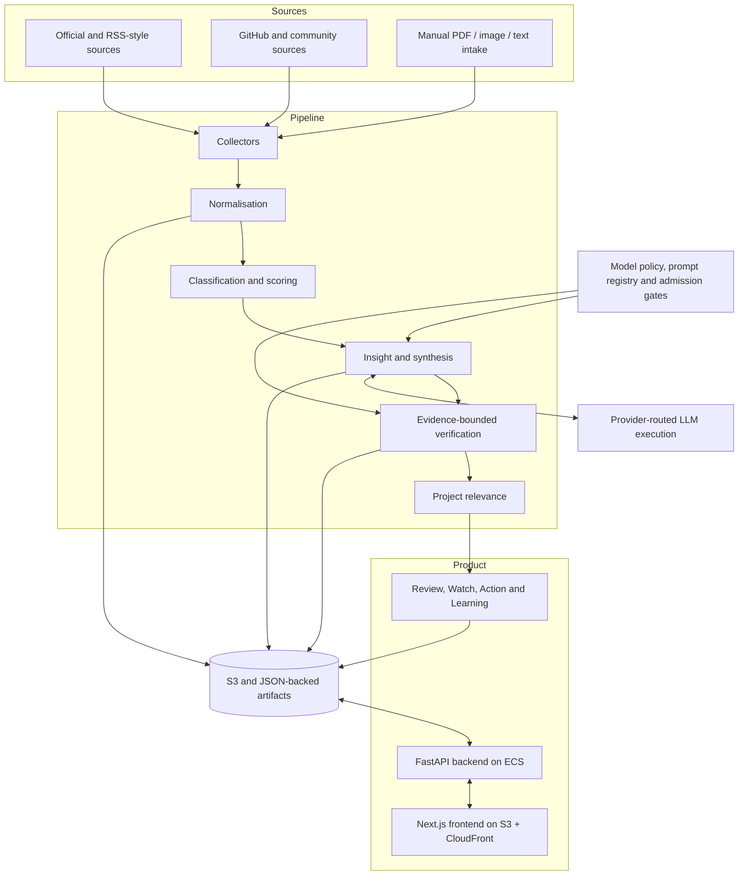

# AI Radar

**An evidence-bounded AI intelligence system that turns fast-moving AI ecosystem signals into project-level judgment — without allowing weak evidence to become automatic action.**

[Live product](https://app.ai-radar-lab.com) · [Evidence portfolio](https://app.ai-radar-lab.com/portfolio) · [Backend API](https://api.ai-radar-lab.com) · [Case study](docs/portfolio/CASE_STUDY.md) · [Architecture](docs/portfolio/ARCHITECTURE.md) · [Roadmap](ROADMAP.md)


> **Public portfolio snapshot:** application source code and selected architecture, governance, evaluation, and product documentation are included. Private runtime data, personal context, deployment operations, and the private repository's Git history are intentionally excluded.

## Portfolio Overview

| | |
|---|---|
| **Problem** | AI ecosystem information is fragmented, fast-moving, and often weakly verified. A feed can collect more information without improving decision quality. |
| **What I built** | A live system that collects external signals, generates structured interpretations, maps them to active projects, and turns selected intelligence into reviewable judgment objects. |
| **Core differentiator** | Claim-aware evidence classification and hard downstream-action gates prevent relevance, generated interpretation, or private reflection from being misrepresented as verified evidence. |
| **Technical shape** | Python, FastAPI, Next.js, AWS ECS, S3, CloudFront, multi-provider LLM routing, structured prompt contracts, and file-backed state artifacts. |
| **My ownership** | Product definition, architecture, trust boundaries, acceptance criteria, implementation direction, validation, and production operation. AI coding assistants are implementation tools; architecture and admission decisions remain human-owned. |

## The 90-Second Story

Most AI monitoring products stop at collection and summarisation. AI Radar was built around a harder question:

> **When should generated intelligence be allowed to influence a real project decision?**

The system separates four concepts that are often collapsed together:

1. a source was observed;
2. a model interpreted it;
3. a claim is supported by traceable evidence;
4. a human is willing to turn that claim into a project action.

AI Radar preserves those boundaries through provenance metadata, claim-level verification, explicit source categories, blocked downstream actions, and auditable human override paths.

```text
Signal -> Insight -> Trend -> Strategic Intelligence -> Decision -> Review -> Learning
```

## Core Workflow



## What Makes It Different

### Intelligence, not another feed

Signals are normalised, interpreted, synthesised across time, and mapped to active projects. The product is designed to explain **why a development matters** and **what confidence is justified**, not only what was published.

### Evidence-bounded AI

AI Radar does not claim to automatically prove external information true. It classifies evidential status and uses that status to control downstream eligibility.

```text
Relevance is not support.
Interpretation is not evidence.
Reflection is not external fact.
Human override is not silent automation.
```

Key invariants:

- weak evidence may support investigation, but not automatic action;
- empty verification metadata must not be labelled as verified insight;
- `blocked_downstream_actions` are hard gates for automatic Project Takeaway and low-risk Action paths;
- human overrides must be explicit, auditable, and exceptional;
- rejected history may provide caution context, but cannot become claim support.

### Review and learning

Project Takeaways support Confirm, Reject, Dismiss, Watch, and Action outcomes. ReviewRecords, CalibrationEvents, follow-up observations, and trajectory events make it possible to examine how judgment changed over time.

## Architecture at a Glance



See [docs/portfolio/ARCHITECTURE.md](docs/portfolio/ARCHITECTURE.md) for the component and trust-boundary view.

## Product Surfaces

| Surface | Purpose |
|---|---|
| **Signals** | Browse normalised source records and metadata. |
| **Radar** | Review daily intelligence summaries and topic movement. |
| **Workspace** | Connect intelligence to active projects and stored context. |
| **Project Takeaways** | Review, watch, action, and learning surface for project-level judgment. |
| **Final Takeaways** | Freeze a review bundle and create a human-confirmed artifact without bypassing verification gates. |
| **Manual Intelligence** | Analyse user-provided PDF, image, HTML, Markdown, and text material. |
| **AI Agent Watch** | Track agent-related repositories and ecosystem activity. |
| **Friction Signals** | Identify adoption barriers, workflow pain points, and opportunity patterns. |
| **Reflections** | Use long-horizon cognitive context without treating it as external evidence. |
| **Dev Inbox** | Capture scoped bugs and coding-agent handoff drafts. |

## Engineering Evidence

| Area | Review path |
|---|---|
| Backend composition and startup controls | [`backend/app/main.py`](backend/app/main.py) |
| API routes | [`backend/app/routes/`](backend/app/routes/) |
| Domain and orchestration services | [`backend/app/services/`](backend/app/services/) |
| Frontend application | [`frontend/app/`](frontend/app/) |
| Daily ingestion | [`app/main_summary_v2.py`](app/main_summary_v2.py) |
| Source collectors | [`signal_collectors/`](signal_collectors/) |
| Prompt capability registry | [`backend/app/prompts/registry.py`](backend/app/prompts/registry.py) |
| Architecture decisions | [`docs/adr/`](docs/adr/) |
| Governance and evaluation | [`docs/governance/`](docs/governance/) and [`docs/evaluation/`](docs/evaluation/) |
| Tests | [`tests/`](tests/) |

## Selected Architecture Decisions

- [ADR-0003 — Runtime-Agnostic Skill Registry](docs/adr/0003-runtime-agnostic-skill-registry.md)
- [ADR-0009 — Model Provenance Schema](docs/adr/0009-model-provenance-schema.md)
- [ADR-0010 — External Insight Admission Gate](docs/adr/0010-external-insight-admission-gate.md)
- [ADR-0011 — Evidence Pack Source Excerpt Policy](docs/adr/0011-evidence-pack-source-excerpt-policy.md)
- [ADR-0013 — AI Discussion Governed Claim Boundary](docs/adr/0013-ai-discussion-governed-claim-boundary.md)
- [ADR-0015 — Claim-Set Composition Underdetermination Gate](docs/adr/0015-claim-set-composition-underdetermination-gate.md)

## Public Review Path

1. Read this page for the product and system boundary.
2. Read the [portfolio case study](docs/portfolio/CASE_STUDY.md) for the engineering narrative and trade-offs.
3. Read [ADR-0010](docs/adr/0010-external-insight-admission-gate.md) for the admission-gate design.
4. Inspect the backend composition, service layer, frontend, collectors, and prompt registry.
5. Read the [roadmap](ROADMAP.md) to distinguish implemented foundations from future work.

### Local execution boundary

This repository is a sanitised source snapshot, not a copy of the private production environment. No credentials or private data are required to inspect the source. Provider-backed, AWS-backed, upload, and production-equivalent flows require the operator to supply their own configuration and infrastructure.

The environment template is [`.env.example`](.env.example). A deterministic fixture-backed public demo mode is a planned portfolio improvement; until then, the live product and source-review paths are the most representative evaluation surfaces.

## Repository Map

```text
ai-radar-aws-public/
├── app/                    # ingestion and summary orchestration
├── backend/app/            # FastAPI routes, services, prompts and policies
├── frontend/app/           # Next.js product UI
├── signal_collectors/      # collectors and normalisation
├── agent-skills/           # agent collaboration protocols
├── tests/                  # unit, contract and integration-oriented tests
├── docs/adr/               # architecture decision records
├── docs/governance/        # governance boundaries
├── docs/evaluation/        # evaluation design
└── docs/portfolio/         # recruiter-facing case study and architecture
```

## Current Development Focus

- strengthen Project Takeaway review, watch, action, and trajectory loops;
- harden manual upload end to end;
- improve project matching and knowledge quality;
- strengthen verification metadata and held-out evaluation;
- improve skill and prompt contract discipline;
- preserve clear boundaries between generated context, verified evidence, and action eligibility.

See [ROADMAP.md](ROADMAP.md) for current direction.

## Documentation

- [Portfolio case study](docs/portfolio/CASE_STUDY.md)
- [Portfolio architecture](docs/portfolio/ARCHITECTURE.md)
- [Product specification](AI_RADAR_PRODUCT_SPEC.md)
- [Roadmap](ROADMAP.md)
- [Public documentation index](docs/README.md)
- [Architecture decisions](docs/adr/README.md)
- [Public release notes](PUBLIC_RELEASE_NOTES.md)

## License

This project is available under the [MIT License](LICENSE).

## Public language policy

Public source, documentation, tests, and UI copy are maintained in English.
Run `python scripts/check_public_english.py` before publishing changes.
