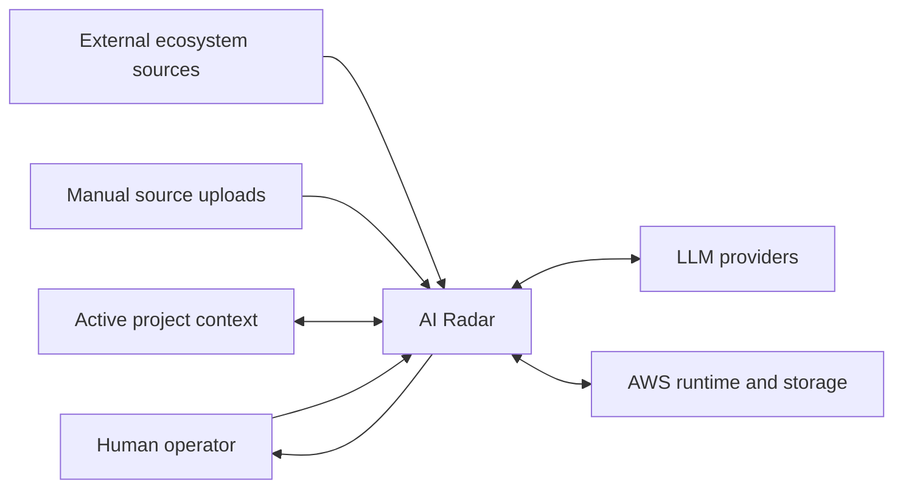
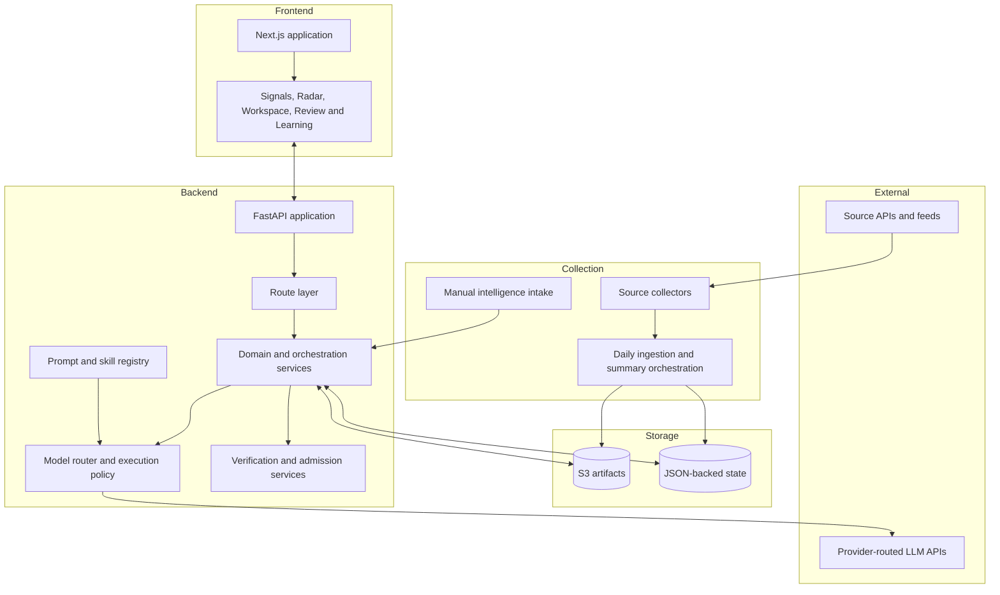
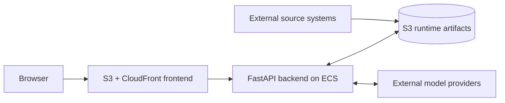
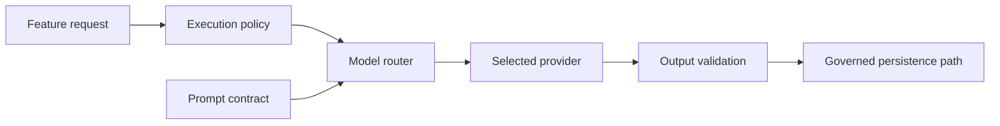
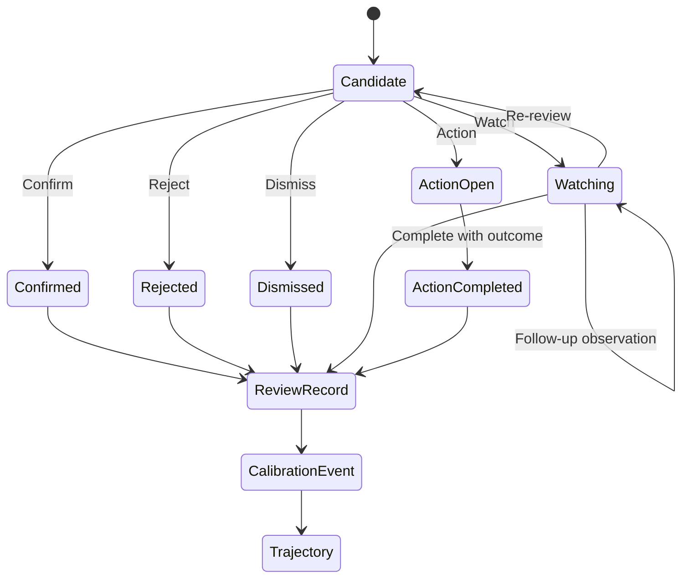

# AI Radar — Portfolio Architecture

## Purpose

This document gives recruiters and technical reviewers a compact view of AI Radar's implemented system shape and trust boundaries.

## System Context



AI Radar sits between information overload and human judgment. It owns collection, interpretation, synthesis, verification metadata, project relevance, and review preparation. The operator retains strategic confirmation and action commitment.

## Runtime Components



## Deployment Shape



The public repository intentionally excludes private deployment workflows and operations material. This diagram describes the published runtime shape, not a public deployment template.

## Trust Boundaries

### 1. Source content versus generated interpretation

Observed source material and model-generated interpretation are different artifact types. Generated summaries cannot silently become primary evidence.

### 2. Relevance versus support

A signal can be highly relevant to a project while remaining unsupported as evidence for a factual claim. Project matching does not grant verified status.

### 3. Verification versus action eligibility

Verification metadata contributes to downstream eligibility, but final action remains separate. `blocked_downstream_actions` prevent unsupported or thin-evidence paths from automatically producing Project Takeaways or low-risk Actions.

### 4. Reflection versus external evidence

Reflection can provide cognitive and historical context. It cannot support an external factual claim without an explicit conversion and review path.

### 5. Open-ended discussion versus governed state

AI Discussion may use external search for investigation, but it has no direct write or promotion path into verified evidence, verification state, or downstream action.

### 6. Public source versus private operations

The public repository includes source code and selected documentation. It excludes runtime data, personal context, uploads, deployment operations, private fixtures, and private Git history.

## Core Admission Invariant

```text
A downstream judgment object must carry sufficient verification context,
or be explicitly categorised as unverified, manual, review-only, or override,
with corresponding blocked actions and audit metadata.
```

This prevents missing metadata from being interpreted as clean verification.

## Model Execution Boundary



The prompt registry is the source of truth for managed prompt capabilities. Provider choice and execution rules are controlled separately from feature semantics.

## Review and Learning Model



Rejected and dismissed outcomes may shape bounded caution context, but do not become evidence for later claims.

## Code Map

| Concern | Primary location |
|---|---|
| Backend composition | [`../../backend/app/main.py`](../../backend/app/main.py) |
| Routes | [`../../backend/app/routes/`](../../backend/app/routes/) |
| Services and policies | [`../../backend/app/services/`](../../backend/app/services/) |
| Prompt registry | [`../../backend/app/prompts/registry.py`](../../backend/app/prompts/registry.py) |
| Frontend | [`../../frontend/app/`](../../frontend/app/) |
| Daily orchestration | [`../../app/main_summary_v2.py`](../../app/main_summary_v2.py) |
| Collectors | [`../../signal_collectors/`](../../signal_collectors/) |
| Architecture decisions | [`../adr/`](../adr/) |
| Governance | [`../governance/`](../governance/) |
| Evaluation | [`../evaluation/`](../evaluation/) |

## Architectural Trade-offs

### Why not automatically promote high-scoring signals?

Importance and project relevance do not prove factual support. Automatic promotion would optimise throughput at the cost of epistemic integrity.

### Why retain human review?

Strategic value depends on context, opportunity cost, timing, and project commitment. Those judgments are not reducible to source verification alone.

### Why use a public snapshot rather than mirror the private repository?

The production repository contains sensitive runtime and operational material. A sanitised snapshot preserves inspectable engineering evidence without exposing private state or copying historical secrets.

### Why use explicit prompt contracts?

LLM behaviour is part of the product. Managed capabilities make ownership, expected output, evaluation, and model routing easier to reason about than scattered inline prompts.

## Related Documents

- [Portfolio case study](CASE_STUDY.md)
- [Product specification](../../AI_RADAR_PRODUCT_SPEC.md)
- [Roadmap](../../ROADMAP.md)
- [ADR index](../adr/README.md)
- [Public release notes](../../PUBLIC_RELEASE_NOTES.md)
